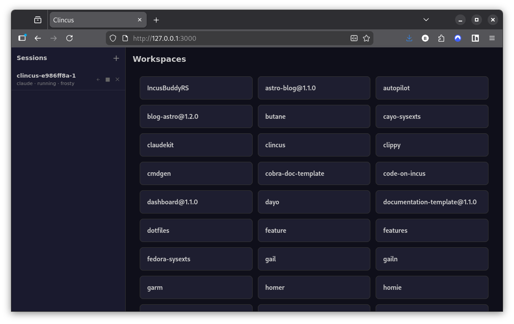
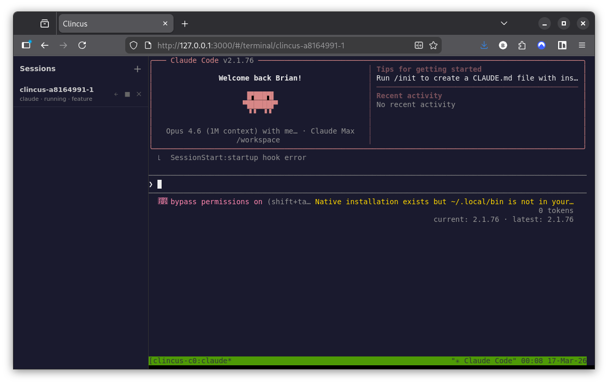

# Clincus

Secure and fast container runtime for AI coding tools on Linux.

Run [Claude Code](https://docs.anthropic.com/en/docs/claude-code),
[GitHub Copilot CLI](https://gh.io/copilot),
[opencode](https://github.com/nicholasgasior/opencode), and other AI assistants in isolated
[Incus](https://linuxcontainers.org/incus/) containers with session
persistence, a web dashboard, and resource limits.



---

## Features

| Feature | Description |
|---------|-------------|
| **Container isolation** | Each session runs in its own Incus container, fully isolated from your host |
| **Session persistence** | Save and resume AI conversations with full history across container restarts |
| **Web dashboard** | Launch and manage sessions from your browser with a built-in Svelte SPA |
| **Multi-tool support** | Claude Code, GitHub Copilot CLI, opencode, and custom tools configurable per project |
| **Workspace mounting** | Project files are bind-mounted into containers with UID-shifting for security |
| **Snapshots** | Checkpoint and rollback container state for safe experimentation |
| **Resource limits** | CPU, memory, disk I/O, and time limits per session |
| **File transfer** | Push and pull files between host and containers with `clincus file` |

---

## Quick Start

```bash
# Build the container image (one-time setup)
clincus build

# Start a Claude Code session in the current directory
clincus shell

# Start an opencode session in a specific workspace
clincus shell --tool opencode ~/my-project

# List active sessions
clincus list

# Open the web dashboard
clincus serve --open
```



---

## Navigation

### [Getting Started](getting-started/prerequisites.md)

New to Clincus? Start here.

- [Prerequisites](getting-started/prerequisites.md) — system requirements and Incus setup
- [Installation](getting-started/install.md) — install from release or build from source
- [Quick Start](getting-started/quickstart.md) — build your first image and run a session

### [Guides](guides/sessions.md)

Task-oriented documentation for common workflows.

- [Sessions](guides/sessions.md) — session lifecycle, persistence, and multi-slot usage
- [Workspaces](guides/workspaces.md) — workspace mounting and file transfer
- [Web Dashboard](guides/web-dashboard.md) — browser-based session management
- [Tools](guides/tools.md) — configuring Claude Code, Copilot, opencode, and custom tools
- [Images](guides/images.md) — building and customizing container images
- [Snapshots](guides/snapshots.md) — checkpointing and rolling back container state
- [Resource Limits](guides/resource-limits.md) — CPU, memory, and time limits

### [Reference](reference/cli.md)

Complete reference documentation.

- [CLI Reference](reference/cli.md) — every command and flag
- [Configuration](reference/config.md) — TOML config format and all options
- [API Reference](reference/api.md) — REST API and WebSocket endpoints

### [Architecture](architecture/overview.md)

How Clincus works under the hood.

- [Overview](architecture/overview.md) — container lifecycle, PTY bridging, package structure
- [Contributing](architecture/contributing.md) — dev setup, tests, and PR process

---

## Attribution

Clincus is derived from [code-on-incus](https://github.com/mensfeld/code-on-incus)
by [Maciej Mensfeld](https://github.com/mensfeld). The web dashboard was inspired by
[wingthing](https://github.com/ehrlich-b/wingthing) by [ehrlich-b](https://github.com/ehrlich-b).

Licensed under the [MIT License](https://github.com/bketelsen/clincus/blob/main/LICENSE).
